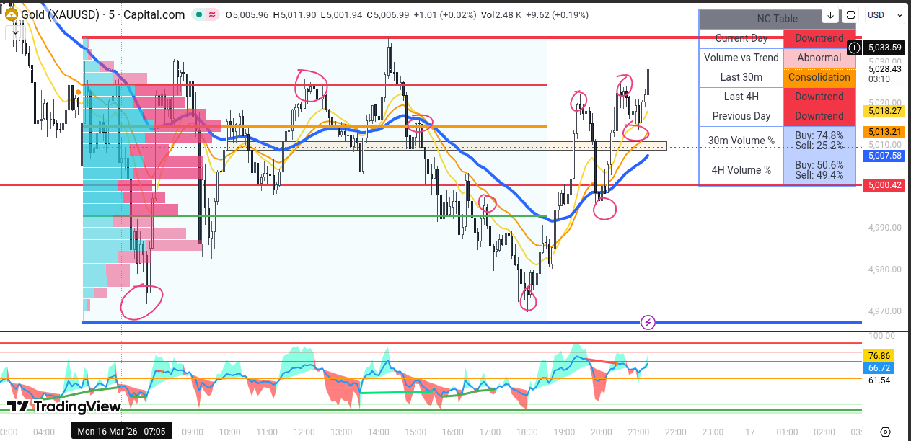
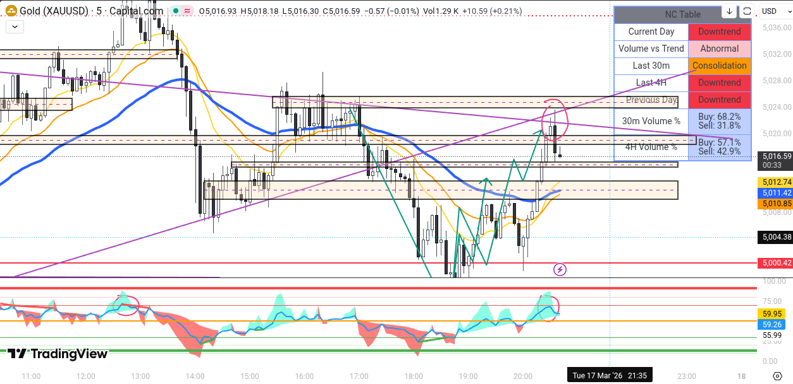
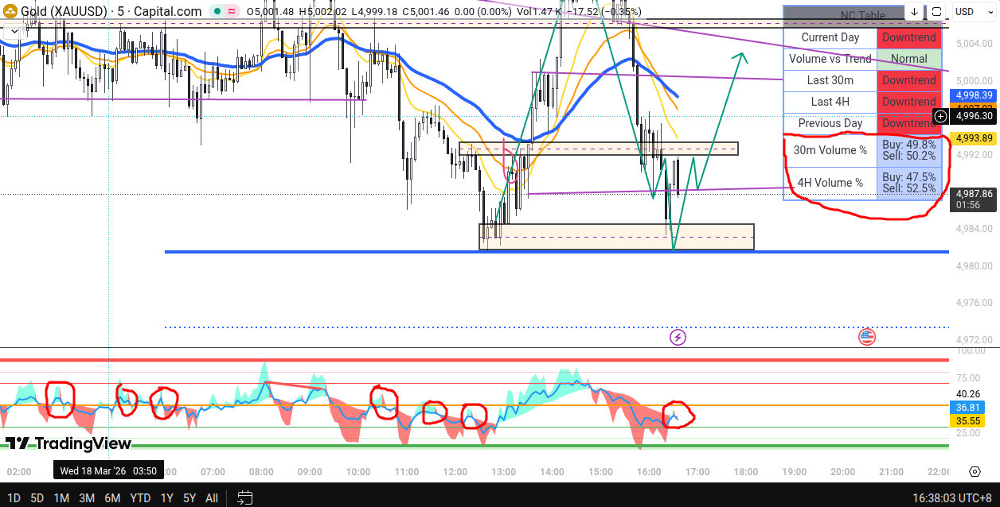
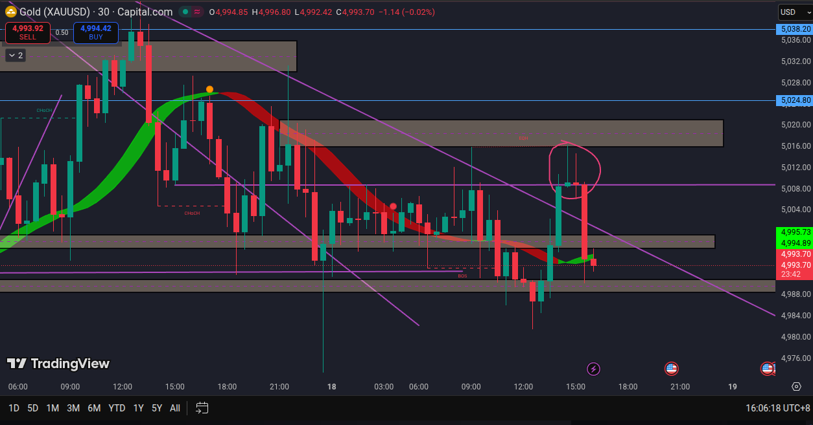
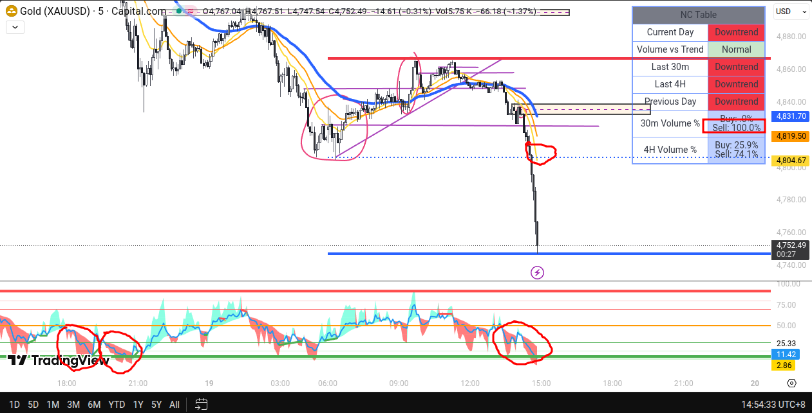
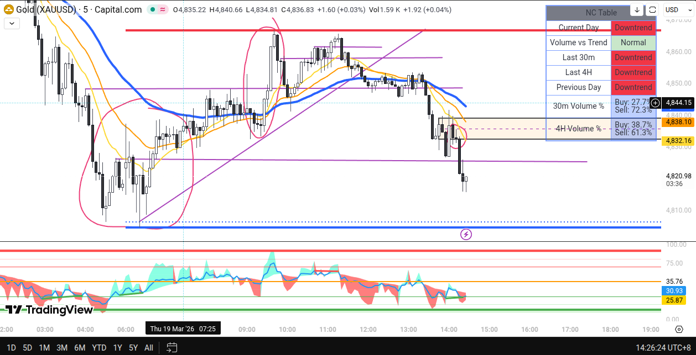
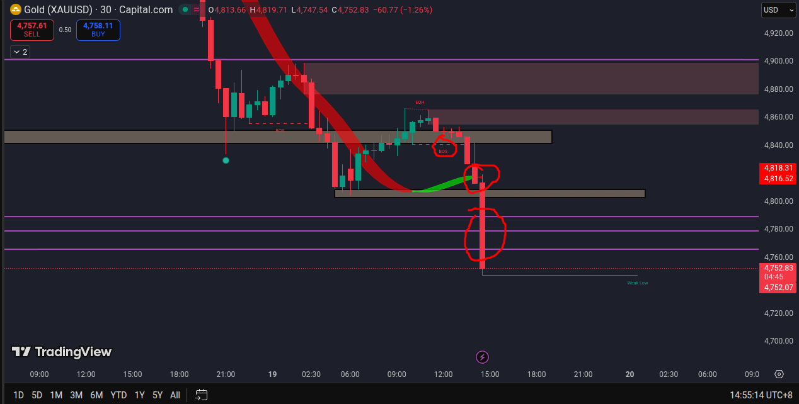

# My Trading
**NCryptsion's Trading Journey and Knowledge Hub.** 
This is based on my personal journey and experiences. You may use it as a source of learning, but it may not necessarily apply the same way for everyone, as each person is unique. Their mentality, behavior and likewise.

## Sayings
- The simpler the setup is, the better it is.
- Setup without multiple backtests is simply gambling.
- Lower TF for execution and substructure analysis, and Higher TF for overall trend and bias. Which is why regularly checking multiple TF is important.
- Sometimes, an instrument does not follow technical analysis, especially when it is heavily influenced by external factors such as geopolitical conflicts, political statements and other significant events.
- If you can't master liquidity (e.g. liquidity sweep), resistance and support then trading is simply not for you.
- Never trade with emotions and feelings, only trade with logics. ONLY LOGICS, if any other then you must take a break or rest.
- It is important to analyze your primary instrument market movements as thoroughly as possible to develop intuition and strengthen the foundation of your analysis, even when you're not trading. Over time by recognizing recurring price action patterns, you will be able to anticipate potential market behavior better.
- There is always an opportunity in trading, never FOMO.
- Never chase in trading, instead set a trap and wait like a trapdoor spider.
- Always calculate your risk before making a trade, always use stop-lost proactively (be careful of liquidity grab and stop hunt).
- Be flexible, always adapt mid-game (there are times where everything is right, then it goes south real fast).
- Always set your maximized risk where its still withdrawable in your broker. Always remember that stop lost is always a must no matter what, don't trade without it.

## Mistakes
- Always have a checklist for your setup, if everything does not check, question yourself and everything before concluding your next move.
- Not having your own schedules for trading, the day and time (example: Monday, 1-3 PM and 6-8 PM only).
- If the volume MA is against it's bars, then something is wrong (potential reversal).
- Always trade with confirmation, better be safe than sorry.
- Never trade in a bad consolidation.
- Never ignore the price movement and volume of the current bar equal to it's remaining time.
- Never ignore the trend or bias in LTF too.
- Never trade in low volatility or volume.
- Never trade near Fed Talks or When there is a sudden strong bullish or bearish momentum for no reason, or you don't know what is going on yet.
  - Careful of the instrument reaction as well as what the insiders might do.
  - It's important to wait until liquidity decision is made (which side it will continue).
- Sometimes ignoring the break of structure.
- Sometimes not placing stop-lost because of fearing stop-hunt (you must place a stop-lost in high volatility or momentum in case things go south).
- Always learn from your mistakes.
- Always trust your setup, analysis and from what you have experienced. If you don’t trust your setup then don’t bother risking your money. If you trust your setup you see the long term not short term–as price can have fake momentums or hit stop loses of small traders.
	- **Example:** The volume bar EMA does not match with the amount of volume bar and their color. Such as the EMA is too high but the volume bars in many timeframe is full of red bars.

## Losses
- **2025-03-19:** Broke the "Never trade with emotions and feelings, only trade with logics. ONLY LOGICS, if any other then you must take a break or rest." rule, did not acknowledged the 30m Volume both the Buy and Sell as well as break of structure, and did not wait for confirmation. Flip!

## Notes
- **Core Indicator**
  - 30m Volume for Buy is 100% = Buyers Rally (always keep in mind of reversal)
    - Only trade after confirmation candle and sellers volume is increasing.
  - 30m Volume for Sell is 100% = Sellers Rally (always keep in mind of reversal)
    - Only trade after confirmation candle and buyers volume is increasing.
  - If the market movement is against the Core Indicator **30m Volume %** and **4H Volume %** (closely, vise-versa but always keep in mind of **30m Volume %**) then a potential reversal is possible and the movement may respect any resistance and support there is.
- **Repetitive Patterns**
  - If divergence is oversold, the EMAs are following very close (acts as a magnet), it hits a good support (mostly if it's the current day lower low) then reversal is inevitable.
  - If divergence is overbought, the EMAs are following very close (acts as a magnet), it hits a good resistance (mostly if it's the current day higher high) then reversal is inevitable.
  - Hitting resistance and support in low volatility tends to be respected more, but sudden momentum is also possible (risk).

## Assets
### Gold (XAUUSD)
**Best Sessions**
- New York
- London–NY overlap

**Characteristics**
- Huge volatility.
- Big impulsive moves.
- Reacts strongly to news and liquidity.

### Silver (XAGUSD)
**Best Sessions**
- New York
- London–NY overlap

**Characteristics**
- More explosive breakouts than gold.
- Whipsaws during low liquidity (especially Asia session).
- Moves strongly with gold trends but often lags first, then accelerates.

## Indicators
- The indicators from **EXNOVA-INDICATORS** are the indicators I have used when I first started trading with such determination, I moved from Olymptrade (my first broker) to Exnova.

**Main (Lower TF)**
- [Core Indicator](./Core%20Indicator.pine): Minimalistic and Simple-As-Possible Indicator I made.
  - 3 EMAs (14, 26, 50).
  - Automatically place a resistance and support from current day higher high and lower low.
  - Automatically place a resistance and support from the previous day higher high and lower low (dotted).
  - Detect current day and previous day trend.
  - Detect abnormally in Volume vs Trend.
  - Detect last 4 hours and 30 minutes trend.
  - Detect the volume of last 4 hours and 30 minutes.
  - Automatically place a resistance and support for the candle with the overall ATH in both it's upper (resistance and support) and lower wicked (resistance) as purple dotted horizontal line.
- [Core Divergence](./Core%20Divergence.pine): Improved version of the existing one created by [fikira12](https://github.com/fikira12).
  - Detect reversals, overbought and oversold.
  - Better resistance and support placed from repetitive momentums.

**Main (Higher TF)**
- **LuxAlgo - Smart Money Concepts**
  - Market structure.
  - Price action.
- **%R Trend Exhaustion**
  - Used to find potential reversals.
  - Awful for lower TF.
  - Minimum TF is 2H with very high accuracy.

**Helpers**
- **Koncorde Plus**
  - Used to identify sections trend.
  - Used to identify reversals by sudden momentum, accurate.
  - Accurate in higher time-frame minimum of 30 minutes.
- **Hull Suite**
  - Any TF but mostly accurate in 30 minutes+.
  - Used to identify overall flow of trend.
  - Acts as resistance and support.
- **Machine Learning: Lorentzian Classification (jdehorty)**
  - Minimum TF 15 minutes, 30 minutes is nicer.
  - Acts as resistance and support.
  - Used to identify overall flow of trend.
  - Uses machine learning.

## Suspicious
### High Volume MA, Opposite Volume
When you see more red volume but the Moving Average (MA) is still high/up, it usually means the market is pulling back inside an uptrend, not necessarily reversing.

**Pullback in an Uptrend**
- MA high/upward = overall trend is bullish.
- Red volume = sellers active temporarily.

## Screenshots
### 2025-03-16
**LTF 1** 
Mastering the art of liquidity, resistance and support. Thinking like other players, institutions and whales that are also on the game.

### 2025-03-17
**LTF 1** 
Overbought, the NC table is indicating it's an Abnormal though buying volume is high. on my other device where a volume indicator is used, the MA is against it's bars. All these checks out for a bearish reversal, if it's bullish but something is wrong, it will likely reverse.

### 2025-03-18
**LTF 1** 
It did a 1 bar reversal before reversing again, on my other device where a volume indicator is used, the MA is against it's bars hence the bearish reversal.

Regarding the 2 strong supporst, those are also confirmed in 2H and 4H timeframe where it respected the support.

**HTF 1** 
This pattern repeats a lot and it just works. If the first green bar is starting to get absorb by sellers then wait for the confirmation from the 2nd bar, if the selling volume is still high then reversal is possible.

### 2025-03-19
**LTF 1** 

**LTF 2** 

**HTF 1** 
